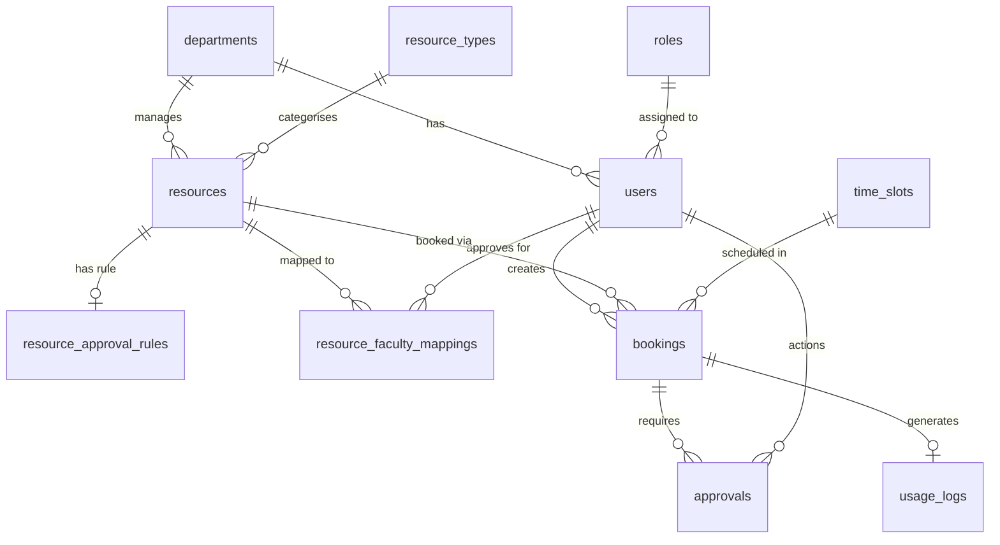

# Unified Resource Booking System

A full-stack web application for managing campus resource bookings — labs,
classrooms, seminar halls, and equipment — with structured approval workflows,
role-based access control, and real-time status tracking.

**Live Demo:** https://unified-booking-system-hjhf.onrender.com/login  
> ⚠ Hosted on Render free tier — first load may take 30–60s after inactivity.
> If a 500 error appears, wait a few seconds and reload.

---

## Features

- **Conflict-safe booking** — server-side collision detection prevents
  double-booking of any resource across slot and date
- **Configurable approval engine** — per-resource ANY (one approval sufficient)
  or ALL (every assigned faculty must approve) rule logic, with per-faculty
  decision tracking and rejection reason propagation to the requesting user
- **Role-based access control** — three distinct user tiers enforced via
  custom Flask route decorators:
  - **Student** — submit and track bookings
  - **Faculty** — approve or reject assigned resources via a dedicated dashboard
  - **augsd (Super Admin)** — manage resources, configure approval rules,
    assign faculty, and override any booking system-wide
- **Automated audit logging** — usage log entries generated automatically on
  booking approval, capturing the full lifecycle of each resource request
- **AI Insights** — live booking statistics sent to the Gemini API for
  natural-language dashboard summaries, with a deterministic fallback
- **Booking Summary** — analytics dashboard restricted to augsd, showing
  status breakdowns and top resources by booking frequency

---

## Tech Stack

| Layer | Technology |
|-------|-----------|
| Frontend | HTML5, CSS3, Bootstrap 5, Jinja2, JavaScript |
| Backend | Python 3, Flask, SQLAlchemy ORM |
| Database | PostgreSQL (Supabase managed cloud) |
| Server | Gunicorn (WSGI), WhiteNoise (static files) |
| Deployment | Render |
| AI | Google Gemini API (`gemini-1.5-flash`) |

---

## Database Schema

11-table normalized relational schema (3NF) with foreign-key integrity,
ENUM state constraints, and automated audit logging.



**Key design decisions:**
- `resource_approval_rules` — separated from `resources` to support optional,
  per-resource ANY/OR and ALL/AND approval logic without nullable columns
- `resource_faculty_mappings` — junction table enabling many-to-many assignment
  of faculty approvers to resources, evaluated by the approval engine at runtime
- `bookings.status` — ENUM (`pending` · `approved` · `rejected` · `cancelled`)
  enforced at the database level, never free-text
- `usage_logs` — uniquely constrained to one log per booking; auto-populated
  on approval to separate confirmed occupancy from booking intent

---

## Local Setup

**Prerequisites:** Python 3.11+, PostgreSQL (or a Supabase project)

```bash
# 1. Clone
git clone https://github.com/Sahaj47/unified-booking-system.git
cd unified-booking-system

# 2. Install dependencies
pip install -r requirements.txt

# 3. Configure environment
cp .env.example .env
# Edit .env — fill in DATABASE_URL, SECRET_KEY, GEMINI_API_KEY

# 4. Initialise database and seed demo data
python seed.py

# 5. Run
flask run
# or for production-equivalent:
gunicorn app:app --workers 2
```

---

## Environment Variables

| Variable | Required | Description |
|----------|----------|-------------|
| `DATABASE_URL` | ✅ | PostgreSQL connection URI |
| `SECRET_KEY` | ✅ | Flask session signing key |
| `GEMINI_API_KEY` | ⬜ | Google Gemini key — falls back to rule-based summary if absent |

---

## Demo Credentials

| Role | Email | Password |
|------|-------|----------|
| Super Admin | augsd@college.edu | augsd123 |
| Faculty | bob@college.edu | pass123 |
| Student | alice@college.edu | pass123 |

---

## Deployment

The application is deployed on **Render** with a **Supabase** managed
PostgreSQL database.

- Build command: `pip install -r requirements.txt`
- Start command: `gunicorn app:app --workers 2 --timeout 120`
- All secrets injected via Render environment variables — nothing hardcoded

See [Supabase](https://supabase.com) and [Render](https://render.com) docs
for full deployment steps.